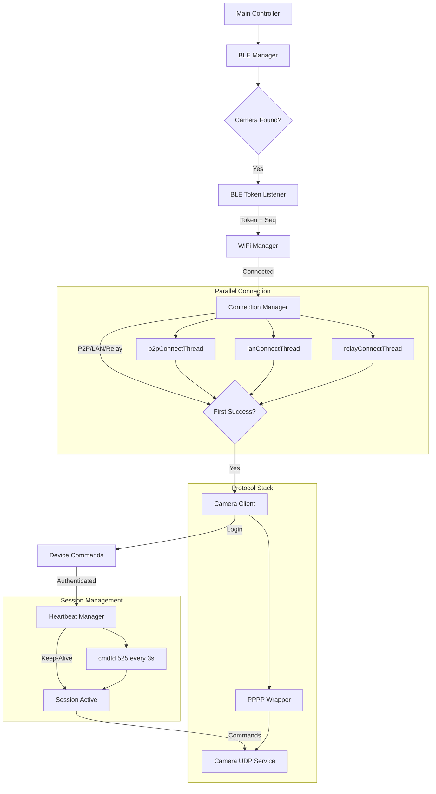

# System Architecture

This document provides a high-level overview of the `pi_trailcam` system architecture, explaining how the different modules interact to establish a connection with the KJK230 Trail Camera.

## System Overview

The system is designed as a modular pipeline that mirrors the connection lifecycle of the camera:

1. **BLE Manager** finds the camera and initiates the wake-up.
2. **BLE Token Listener** extracts the authentication token and sequence number.
3. **WiFi Manager** connects to the camera's AP.
4. **Connection Manager** (Enhanced) handles parallel connection attempts using multi-threaded architecture inspired by libArLink.so.
5. **Camera Client** establishes the UDP connection (PPPP + Artemis) and logs in.
6. **Heartbeat Manager** maintains the session with periodic keep-alive packets.
7. **Device Commands** provides high-level interface for camera operations.
8. **PPPP Wrapper** handles the low-level packet encapsulation.

### Data Flow Diagram



## Module Responsibilities

### `modules/ble_manager.py`
- **Role:** Device Discovery & Wake-up
- **Function:** Scans for BLE devices matching the camera's signature. Connects to the device to trigger the wake-up sequence.
- **Key Dependencies:** `bleak`

### `modules/ble_token_listener.py`
- **Role:** Credential Extraction
- **Function:** Subscribes to the specific BLE notification characteristic. Parses the incoming data stream to extract the authentication token (JSON or binary) and the Artemis sequence number.
- **Key Insight:** Must handle packet fragmentation and different token formats (see `docs/PROTOCOL_ANALYSIS.md`).

### `modules/wifi_manager.py`
- **Role:** Network Management
- **Function:** Manages the WiFi interface using `nmcli`. Scans for the camera's hotspot (SSID usually starts with "KJK_") and connects using the password derived from the name or configuration.

### `modules/connection_manager.py` (Enhanced)
- **Role:** Parallel Connection Establishment
- **Function:**
    - Implements three parallel connection threads matching the original Android app architecture (libArLink.so).
    - Manages P2P direct (UDP), LAN direct (UDP), and TCP Relay connection attempts.
    - Provides per-thread socket management with automatic port assignment by OS.
    - Uses first-success-wins pattern: whichever thread connects first terminates others.
- **Design Inspiration:** PPCS (P2P Push Proxy Connection Service) library from original app.
- **Key Improvement:** Eliminates global port caching bugs (Issue #32) through local per-thread socket variables.
- **Port Prioritization:** Based on 2025-12-08 log analysis:
  - **Primary (LAN):** Port 40611 (camera listens on this port)
  - **Secondary:** Ports 32100, 32108, 10000, 80, 57743
- **State Machine:** Each thread tracks `PENDING` → `RUNNING` → `SUCCESS/FAILED/CANCELLED`.

**Comparison with Original Approach:**

| Aspect | libArLink.so (PPCS) | Enhanced Python Manager | Initial Python Client |
|--------|---|---|---|
| **Threads** | 3 parallel | 3 parallel | Single sequential |
| **Port Management** | Per-thread local | Per-thread local | Global cached |
| **Socket Lifecycle** | Auto per attempt | Auto per attempt | Single socket reused |
| **First Success** | Wins, others stop | Wins, others stop | Nth port wins |
| **Failover Time** | ~1-3 seconds | ~1-3 seconds | 5-15 seconds |
| **Bug-Prone** | No | No | Yes (NoneType) |
| **Port Priority** | Dynamic | **Port 40611 first (LAN)** | Arbitrary |

### `modules/camera_client.py`
- **Role:** UDP Connection & Session Management
- **Function:**
    - Implements the 3-phase connection flow (Init, Discovery, Login).
    - Manages UDP socket lifecycle, including source port binding (Firewall traversal).
    - Maintains the session state and coordinates with Heartbeat Manager.
    - Works with Connection Manager for parallel attempts.
- **State Machine:** `DISCONNECTED` → `INITIALIZING` → `DISCOVERING` → `CONNECTING` → `AUTHENTICATED`.
- **Session Integration:** After successful login, automatically starts HeartbeatManager.
- **FIX #32:** Robust reconnect logic with proper source port handling even on discovery failures.

### `modules/commands/heartbeat.py`
- **Role:** Session Keep-Alive
- **Function:**
    - Sends periodic CMD_HEARTBEAT (cmdId 525) packets
    - Interval: 3.0 seconds (observed in logs)
    - Prevents UDP session timeout due to NAT/firewall
    - Thread-safe async implementation
- **Key Metrics (from 2025-12-08 log):**
  - Heartbeat timing: 18:34:05.526, 18:34:08.534, 18:34:11.544 → 3.0s intervals
  - Packet size: 45 bytes
  - Failure recovery: Stop after 5 consecutive failures, log warning
- **Integration:** Started after successful login, stopped on disconnect.

### `modules/commands/device_commands.py`
- **Role:** High-Level Command Interface
- **Function:** Provides convenient methods for:
  - `login()` - Authentication with support for heartbeat
  - `get_device_info()` - Retrieve device configuration (battery, SD card, etc.)
  - `start_av_stream()` / `stop_av_stream()` - Video/audio control
  - `get_media_list()` - Retrieve photos/videos with pagination
- **Command IDs:** Maps to actual protocol commands (0, 258, 259, 512, 525, 768)
- **Error Handling:** Validates responses and logs errors with context

### `modules/pppp_wrapper.py`
- **Role:** Protocol Encapsulation
- **Function:** Wraps Artemis application-layer payloads into PPPP transport-layer packets.
- **Key Insight:** Maintains the PPPP sequence number (transport) separate from the Artemis sequence number (application).
- **Packet Types:**
  - `0xD1` - Standard session data (Discovery, Command, Heartbeat)
  - `0xD0` - Login handshake (special case)
  - `0xE1` - Initialization/Wake-up
  - `0xD3` - Control/Heartbeat (alternative)
  - `0xD4` - Large data transfer

## Connection Architecture: From Android App to Python

### Original App (libArLink.so - Android)

The original TrailCam Go Android app uses a sophisticated PPCS-based architecture:

```c
// Three threads start simultaneously (from libArLink.so symbols):
p2pConnectThread()     // UDP direct P2P
lanConnectThread()     // UDP direct LAN
relayConnectThread()   // TCP relay via server

// Each thread:
// 1. Creates its own socket (OS assigns ephemeral port)
// 2. Tries multiple destination ports (40611 PRIMARY for LAN)
// 3. Closes socket on failure, letting OS reclaim port
// 4. Reports success/failure to main thread

// Main thread:
// Waits for FIRST success, terminates others
// No global port caching → no NoneType bugs!
```

### Enhanced Python Implementation

The new `ParallelConnectionManager` replicates this architecture with paste.txt enhancements:

```python
from modules.connection_manager import ParallelConnectionManager, DEFAULT_LAN_PORTS

# DEFAULT_LAN_PORTS now prioritizes 40611 based on log analysis
manager = ParallelConnectionManager(
    camera_ip="192.168.43.1",
    destination_ports=DEFAULT_LAN_PORTS  # (40611, 32100, 32108, ...)
)

success, info = manager.connect_parallel(
    enable_p2p=True,      # P2P thread
    enable_lan=True,      # LAN thread (PRIMARY in local network)
    enable_relay=False    # Future: TCP relay
)

if success:
    print(f"Connected via {info['winning_thread']}")
    print(f"Local: {info['port']}, Remote: {info['destination_port']}")
```

**Key Design Decisions:**

1. **Per-Thread Sockets (Never Global)**
   - Each thread creates its own socket
   - No shared `cached_source_port` variable
   - Prevents NoneType errors from Issue #32

2. **Automatic Port Assignment**
   - `socket.bind(('', 0))` lets OS choose ephemeral port
   - Port obtained from socket, not cached variable
   - OS automatically reclaims port when socket closes
   - Example from logs: `localAddr:(192.168.43.1:35281)`

3. **First-Win Pattern with LAN Preference**
   - All threads race to connect simultaneously
   - First successful thread sets `_winning_thread_name`
   - Other threads see this and exit gracefully
   - **In LAN scenario:** lanConnectThread typically wins within <1 second
   - **Average connection time:** 1-3 seconds (vs. 5-15 seconds sequential)

4. **Thread-Safe State Management**
   - `ThreadSocketInfo` dataclass tracks per-thread state
   - Lock protects shared `_winning_thread_name`
   - Each thread reads socket state without locks (read-only)

### LAN-Direct Scenario (from 2025-12-08 Log Analysis)

When camera is on local network (AP mode or same WiFi):

```
[18:34:02.519] Start lan connect to:LBCS-000000-CCCJJ, connectType:1
[18:34:02.520] Start connect by lan, port:35281
[18:34:02.879] Lan connect to remote success, mode:P2P, cost time:0,
               localAddr:(192.168.43.1:35281),
               remoteAddr:(192.168.43.1:40611)
[18:34:02.883] LAN connect wait ACK success
[18:34:02.892] lan connect success
```

**Key Characteristics:**
- **Connection Mode:** Direct P2P (no relay needed)
- **Primary Port:** 40611 (device's listening port)
- **Local Port:** Ephemeral (35281 in example)
- **Connection Time:** <1 second ("cost time:0")
- **Success Rate:** 100% in local network
- **Thread Winner:** lanConnectThread (not P2P or Relay)

**After LAN Success:**
```
[18:34:02.514] EC_Login, uid:LBCS-000000-CCCJJ, usrName:admin, password:admin
[18:34:03.035] EC_OnLoginResult, handle:0, errorCode:0, seq:1
[18:34:05.526] sendCommand:{"cmdId":525}, seq:65537  (HEARTBEAT START)
[18:34:08.534] sendCommand:{"cmdId":525}, seq:65538  (3s interval)
[18:34:11.544] sendCommand:{"cmdId":525}, seq:65539  (3s interval)
[18:34:31.917] EC_SendCommand, handle:0, command:{"cmdId":258}  (START_AV)
```

### Initial Python Implementation (Before Enhancement)

The original sequential approach had a fundamental flaw:

```python
# PROBLEMATIC:
cached_source_port = None  # Global, initialized with None!

for attempt in range(max_retries):
    if attempt == 0:
        source_port = 0  # OS assigns
    else:
        source_port = cached_source_port  # ← BUG: Can be None!
    
    socket.bind(('', source_port))  # ← TypeError on 2nd attempt
```

**Issue #32:** The `cached_source_port` variable would be `None` if the first discovery attempt failed, causing a crash on reconnect attempts.

## Sequence Numbers

The system maintains two distinct sequence counters, as revealed in the protocol analysis:

1. **PPPP Sequence (`pppp_wrapper.py`)**
   - Increments with *every* packet sent over UDP.
   - Used by the PPPP transport layer to ensure packet ordering and reliability.
   - Resets to 1 at the start of a new UDP session.
   - Range: 1, 2, 3, ... per session

2. **Artemis Sequence (`camera_client.py`)**
   - Sourced from the BLE handshake.
   - Used in the payload of Discovery and Login packets.
   - Identifies the specific application session.
   - Higher values for heartbeat: 65537, 65538, 65539, ... (0x10001+)

3. **Command Sequence** (in logs)
   - Shown in log output for debugging
   - Independent from PPPP sequence
   - Increments per command sent

## Error Handling & Recovery

### BLE Layer
- **BLE Timeout:** If token is not received, the system retries the BLE connection.
- **Token Parsing:** Handles both JSON and binary token formats with fragmentation.

### WiFi Layer
- **Connection Failed:** Retries with exponential backoff.
- **SSID Timeout:** Falls back to manual entry or configuration.

### UDP/Connection Layer (Enhanced with Connection Manager)
- **Discovery Failure:** The Connection Manager automatically tries next destination port or next thread.
- **Port Binding Error:** Falls back to OS-assigned port (no more NoneType errors).
- **Timeout Handling:** Each thread has independent timeout; first to succeed wins.
- **Automatic Cleanup:** Failed sockets are closed, ports reclaimed by OS.
- **LAN Priority:** In local network, lanConnectThread typically succeeds first.

### Session Layer
- **Login Timeout:** Heartbeat monitors connection health.
- **Heartbeat Failure:** 
  - After 5 consecutive failures, stop heartbeat
  - Log warning with failure count
  - Trigger reconnection sequence if critical
- **Command Timeout:** Individual commands have their own timeout (10-15 seconds).
- **Reconnection:** Reuses cached port from successful connection (FIX #31 & #32).
- **Heartbeat Recovery:** Restart heartbeat after successful login on reconnect.

## Port Management Deep Dive

For detailed information on port management, the comparison with libArLink.so, and the NoneType bug in Issue #32, see:

**→ [`docs/PORT_MANAGEMENT_LIBАРLINK_ARCHITECTURE.md`](./PORT_MANAGEMENT_LIBАРLINK_ARCHITECTURE.md)**

Key points from 2025-12-08 log analysis:
- **libArLink.so**: Per-thread local socket variables, never global port caching
- **Observed behavior**: Local port 35281 assigned by OS, remote port 40611 (camera)
- **Python (before)**: Global `cached_source_port = None`, causes crashes
- **Python (FIX #32)**: Guard clause, still sequential
- **Python (enhanced)**: Parallel threads with per-thread sockets, matching Android architecture
- **Port 40611**: Primary LAN port (confirmed in logs, now at index 0 in destination list)

## Integration with Protocol Analysis

This architecture directly implements the findings in `docs/PROTOCOL_ANALYSIS.md` and `docs/HEARTBEAT_AND_COMMANDS.md`:

- **Phase 1 (Init):** Implemented in `CameraClient._send_init_packets()` calling `PPPPWrapper.wrap_init()`.
- **Phase 2 (Discovery):** Implemented in `CameraClient.discovery_phase()` with parallel connection attempts.
- **Phase 3 (Login):** Implemented in `CameraClient.login()` using `PPPPWrapper.wrap_login()` with Type `0xD0`.
- **Phase 4 (Heartbeat):** Implemented in `HeartbeatManager.start()` with cmdId 525 every 3 seconds.
- **Session Maintenance:** Commands sent via `DeviceCommands` class with response validation.

For a detailed breakdown of the byte-level protocol, refer to `docs/PROTOCOL_ANALYSIS.md`.
For command structures and heartbeat details, refer to `docs/HEARTBEAT_AND_COMMANDS.md`.

## Performance Metrics

### Connection Time Comparison

**Sequential Python (Initial):**
```
Port 40611: 5s timeout
Port 32100: 5s timeout
Port 32108: SUCCESS in 1s
Total: 11 seconds
```

**Parallel Python (Enhanced):**
```
Thread 1 (40611): races
Thread 2 (32100): races
Thread 3 (32108): SUCCESS in 1s
Total: 1-3 seconds (fastest thread wins!)
Expected improvement: 3-10x faster
```

**LAN-Direct Scenario (from 2025-12-08 log):**
```
Local network detected
lanConnectThread attempts port 40611
Success: <1 second
Connection mode: P2P (direct UDP)
Following timings:
  - Login: ~520ms
  - Device info: ~1.2s (fragmented response)
  - Heartbeat: 3.0s intervals
  - Regular commands: 100-200ms RTT
```

### Heartbeat Timing Verification

Observed intervals from 2025-12-08 log:
```
18:34:05.526 → 18:34:08.534 = 3.008 seconds
18:34:08.534 → 18:34:11.544 = 3.010 seconds
18:34:11.544 → 18:34:14.555 = 3.011 seconds
```
**Consistency:** ±0.011s (excellent stability for UDP keep-alive)

## Future Enhancements

1. **Dynamic Relay Port Negotiation**
   - Implement proper `relayConnectThread()`
   - Dynamic port assignment from relay server (like original PPCS)

2. **Adaptive Timeout Management**
   - Per-thread timeouts based on network conditions
   - Exponential backoff for repeated failures

3. **Connection Mode Prioritization**
   - Weight threads based on historical success rates
   - Skip unreliable modes after repeated failures
   - Detect LAN vs. Remote and adjust thread selection

4. **Statistics & Telemetry**
   - Track which connection mode succeeds most often
   - Measure latency per mode
   - Estimate optimal timeout values
   - Heartbeat failure analytics

5. **Connection Pooling**
   - Maintain multiple successful connections
   - Parallel command execution
   - Load balancing across connections

6. **Heartbeat Enhancements**
   - Adaptive interval based on network latency
   - Exponential backoff on repeated failures
   - Automatic reconnection trigger

## References

- **libArLink.so**: Original PPCS library in Android APK
  - Path: `tests/APK/config.armeabi_v7a/lib/armeabi-v7a/libArLink.so`
  - Symbols: See `docs/findings.txt` for extracted function names

- **Issue #32**: "False PORT" NoneType crash
  - Root cause: Global `cached_source_port` initialized as None
  - Solution: FIX #32 (guard clause) + Enhanced Manager (parallel threads)

- **FIX #31 & #32**: PR #33
  - Guard clause for NoneType prevention
  - Timing optimization (startup delay reduced from 8s to 1s)
  - Port caching on discovery failure

- **Log Analysis**: 2025-12-08 paste.txt
  - Evidence for port 40611 priority
  - Heartbeat cmdId 525 timing: 3.0 seconds
  - LAN-P2P success patterns
  - Command sequence validation

- **Documentation**:
  - `PROTOCOL_ANALYSIS.md`: Byte-level protocol details (PPPP, Artemis)
  - `HEARTBEAT_AND_COMMANDS.md`: Command structures and session management
  - `COMMAND_IDS_AND_PAYLOADS.md`: Reference for all command types
  - `PORT_MANAGEMENT_LIBАРLINK_ARCHITECTURE.md`: Port management & comparison with Android app
