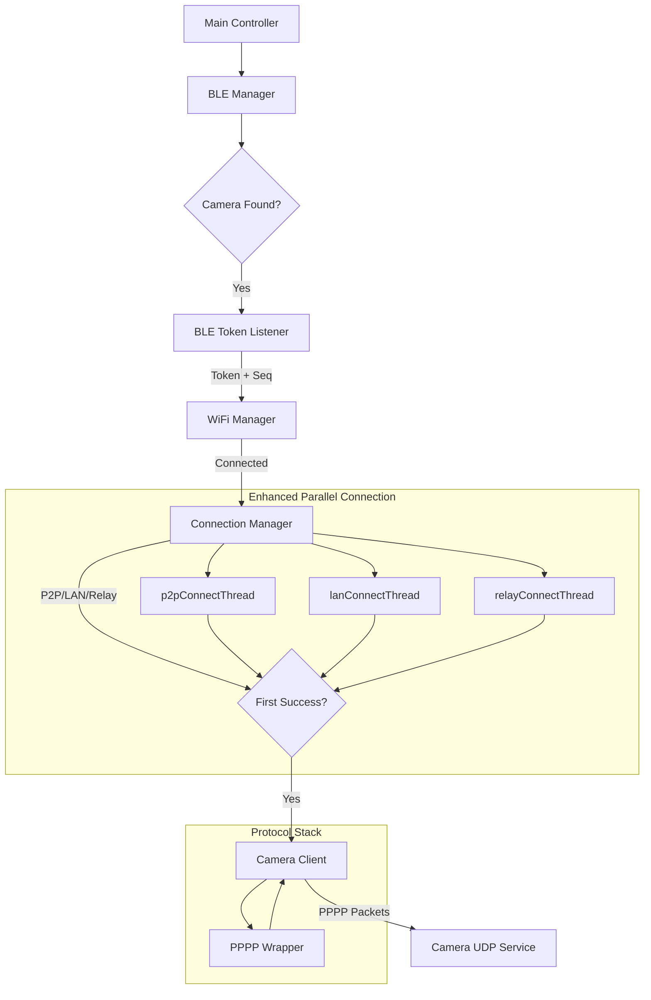

# System Architecture

This document provides a high-level overview of the `pi_trailcam` system architecture, explaining how the different modules interact to establish a connection with the KJK230 Trail Camera.

## System Overview

The system is designed as a modular pipeline that mirrors the connection lifecycle of the camera:

1. **BLE Manager** finds the camera and initiates the wake-up.
2. **BLE Token Listener** extracts the authentication token and sequence number.
3. **WiFi Manager** connects to the camera's AP.
4. **Camera Client** establishes the UDP connection (PPPP + Artemis) and logs in.
5. **Connection Manager** (Enhanced) handles parallel connection attempts using multi-threaded architecture inspired by libArLink.so.
6. **PPPP Wrapper** handles the low-level packet encapsulation.

### Data Flow Diagram



## Module Responsibilities

### `modules/ble_manager.py`
- **Role:** Device Discovery & Wake-up
- **Function:** Scans for BLE devices matching the camera's signature. Connects to the device to trigger the wake-up sequence.
- **Key Dependencies:** `bleak`

### `modules/ble_token_listener.py`
- **Role:** Credential Extraction
- **Function:** Subscribes to the specific BLE notification characteristic. Parses the incoming data stream to extract the authentication token (JSON or binary) and the Artemis sequence number.
- **Key Insight:** Must handle packet fragmentation and different token formats (see `docs/PROTOCOL_ANALYSIS.md`).

### `modules/wifi_manager.py`
- **Role:** Network Management
- **Function:** Manages the WiFi interface using `nmcli`. Scans for the camera's hotspot (SSID usually starts with "KJK_") and connects using the password derived from the name or configuration.

### `modules/connection_manager.py` (NEW - Enhanced)
- **Role:** Parallel Connection Establishment
- **Function:**
    - Implements three parallel connection threads matching the original Android app architecture (libArLink.so).
    - Manages P2P direct (UDP), LAN direct (UDP), and TCP Relay connection attempts.
    - Provides per-thread socket management with automatic port assignment by OS.
    - Uses first-success-wins pattern: whichever thread connects first terminates others.
- **Design Inspiration:** PPCS (P2P Push Proxy Connection Service) library from original app.
- **Key Improvement:** Eliminates global port caching bugs (Issue #32) through local per-thread socket variables.
- **State Machine:** Each thread tracks `PENDING` → `RUNNING` → `SUCCESS/FAILED/CANCELLED`.

**Comparison with Original Approach:**

| Aspect | libArLink.so (PPCS) | Enhanced Python Manager | Initial Python Client |
|--------|---|---|---|
| **Threads** | 3 parallel | 3 parallel | Single sequential |
| **Port Management** | Per-thread local | Per-thread local | Global cached |
| **Socket Lifecycle** | Auto per attempt | Auto per attempt | Single socket reused |
| **First Success** | Wins, others stop | Wins, others stop | Nth port wins |
| **Failover Time** | ~1-3 seconds | ~1-3 seconds | 5-15 seconds |
| **Bug-Prone** | No | No | Yes (NoneType) |

### `modules/camera_client.py`
- **Role:** UDP Connection & Session Management
- **Function:**
    - Implements the 3-phase connection flow (Init, Discovery, Login).
    - Manages UDP socket lifecycle, including source port binding (Firewall traversal).
    - Maintains the session heartbeat.
    - Works with Connection Manager for parallel attempts.
- **State Machine:** `DISCONNECTED` → `INITIALIZING` → `DISCOVERING` → `CONNECTING` → `AUTHENTICATED`.
- **FIX #32:** Robust reconnect logic with proper source port handling even on discovery failures.

### `modules/pppp_wrapper.py`
- **Role:** Protocol Encapsulation
- **Function:** Wraps Artemis application-layer payloads into PPPP transport-layer packets.
- **Key Insight:** Maintains the PPPP sequence number (transport) separate from the Artemis sequence number (application).

## Connection Architecture: From Android App to Python

### Original App (libArLink.so - Android)

The original TrailCam Go Android app uses a sophisticated PPCS-based architecture:

```c
// Three threads start simultaneously (from libArLink.so symbols):
p2pConnectThread()     // UDP direct P2P
lanConnectThread()     // UDP direct LAN
relayConnectThread()   // TCP relay via server

// Each thread:
// 1. Creates its own socket (OS assigns ephemeral port)
// 2. Tries multiple destination ports
// 3. Closes socket on failure, letting OS reclaim port
// 4. Reports success/failure to main thread

// Main thread:
// Waits for FIRST success, terminates others
// No global port caching → no NoneType bugs!
```

### Enhanced Python Implementation

The new `ParallelConnectionManager` replicates this architecture:

```python
from modules.connection_manager import ParallelConnectionManager

manager = ParallelConnectionManager(
    camera_ip="192.168.1.100",
    destination_ports=(40611, 32100, 32108, 10000, 80, 57743)
)

success, info = manager.connect_parallel(
    enable_p2p=True,      # P2P thread
    enable_lan=True,      # LAN thread
    enable_relay=False    # Future: TCP relay
)

if success:
    print(f"Connected via {info['winning_thread']}: port={info['port']}")
```

**Key Design Decisions:**

1. **Per-Thread Sockets (Never Global)**
   - Each thread creates its own socket
   - No shared `cached_source_port` variable
   - Prevents NoneType errors from Issue #32

2. **Automatic Port Assignment**
   - `socket.bind(('', 0))` lets OS choose ephemeral port
   - Port obtained from socket, not cached variable
   - OS automatically reclaims port when socket closes

3. **First-Win Pattern**
   - Threads race to connect
   - First successful thread sets `_winning_thread_name`
   - Other threads see this and exit gracefully
   - Average connection time: 1-3 seconds (vs. 5-15 seconds sequential)

4. **Thread-Safe State Management**
   - `ThreadSocketInfo` dataclass tracks per-thread state
   - Lock protects shared `_winning_thread_name`
   - Each thread reads socket state without locks (read-only)

### Initial Python Implementation (Before Enhancement)

The original sequential approach had a fundamental flaw:

```python
# PROBLEMATIC:
cached_source_port = None  # Global, initialized with None!

for attempt in range(max_retries):
    if attempt == 0:
        source_port = 0  # OS assigns
    else:
        source_port = cached_source_port  # ← BUG: Can be None!
    
    socket.bind(('', source_port))  # ← TypeError on 2nd attempt
```

**Issue #32:** The `cached_source_port` variable would be `None` if the first discovery attempt failed, causing a crash on reconnect attempts.

## Sequence Numbers

The system maintains two distinct sequence counters, as revealed in the protocol analysis:

1. **PPPP Sequence (`pppp_wrapper.py`)**
   - Increments with *every* packet sent over UDP.
   - Used by the PPPP transport layer to ensure packet ordering and reliability.
   - Resets to 1 at the start of a new UDP session.

2. **Artemis Sequence (`camera_client.py`)**
   - Sourced from the BLE handshake.
   - Used in the payload of Discovery and Login packets.
   - Identifies the specific application session.

## Error Handling & Recovery

### BLE Layer
- **BLE Timeout:** If token is not received, the system retries the BLE connection.
- **Token Parsing:** Handles both JSON and binary token formats with fragmentation.

### WiFi Layer
- **Connection Failed:** Retries with exponential backoff.
- **SSID Timeout:** Falls back to manual entry or configuration.

### UDP/Connection Layer (Enhanced with Connection Manager)
- **Discovery Failure:** The Connection Manager automatically tries next destination port or next thread.
- **Port Binding Error:** Falls back to OS-assigned port (no more NoneType errors).
- **Timeout Handling:** Each thread has independent timeout; first to succeed wins.
- **Automatic Cleanup:** Failed sockets are closed, ports reclaimed by OS.

### Session Layer
- **Login Timeout:** Heartbeat monitors connection health.
- **Command Timeout:** Individual commands have their own timeout.
- **Reconnection:** Reuses cached port from successful connection (FIX #31 & #32).

## Port Management Deep Dive

For detailed information on port management, the comparison with libArLink.so, and the NoneType bug in Issue #32, see:

**→ [`docs/PORT_MANAGEMENT_LIBАРLINK_ARCHITECTURE.md`](./PORT_MANAGEMENT_LIBАРLINK_ARCHITECTURE.md)**

Key points:
- **libArLink.so**: Per-thread local socket variables, never global port caching
- **Python (before)**: Global `cached_source_port = None`, causes crashes
- **Python (FIX #32)**: Guard clause, still sequential
- **Python (enhanced)**: Parallel threads with per-thread sockets, matching Android architecture

## Integration with Protocol Analysis

This architecture directly implements the findings in `docs/PROTOCOL_ANALYSIS.md`:

- **Phase 1 (Init):** Implemented in `CameraClient._send_init_packets()` calling `PPPPWrapper.wrap_init()`.
- **Phase 2 (Discovery):** Implemented in `CameraClient.discovery_phase()` with parallel connection attempts.
- **Phase 3 (Login):** Implemented in `CameraClient.login()` using `PPPPWrapper.wrap_login()` with Type `0xD0`.

For a detailed breakdown of the byte-level protocol, refer to `docs/PROTOCOL_ANALYSIS.md`.

## Performance Metrics

### Connection Time Comparison

```
Initial Python (Sequential):
  Port 40611: 5s timeout
  Port 32100: 5s timeout
  Port 32108: SUCCESS in 1s
  Total: 11 seconds

Enhanced Python (Parallel):
  Thread 1 (40611): 5s timeout
  Thread 2 (32100): 5s timeout
  Thread 3 (32108): SUCCESS in 1s
  Total: 1-3 seconds (fastest thread wins!)

Expected improvement: 3-10x faster
```

## Future Enhancements

1. **Dynamic Relay Port Negotiation**
   - Implement proper `relayConnectThread()`
   - Dynamic port assignment from relay server (like original PPCS)

2. **Adaptive Timeout Management**
   - Per-thread timeouts based on network conditions
   - Exponential backoff for repeated failures

3. **Connection Mode Prioritization**
   - Weight threads based on historical success rates
   - Skip unreliable modes after repeated failures

4. **Statistics & Telemetry**
   - Track which connection mode succeeds most often
   - Measure latency per mode
   - Estimate optimal timeout values

5. **Connection Pooling**
   - Maintain multiple successful connections
   - Parallel command execution

## References

- **libArLink.so**: Original PPCS library in Android APK
  - Path: `tests/APK/config.armeabi_v7a/lib/armeabi-v7a/libArLink.so`
  - Symbols: See `docs/findings.txt` for extracted function names

- **Issue #32**: "False PORT" NoneType crash
  - Root cause: Global `cached_source_port` initialized as None
  - Solution: FIX #32 (guard clause) + Enhanced Manager (parallel threads)

- **FIX #31 & #32**: PR #33
  - Guard clause for NoneType prevention
  - Timing optimization (startup delay reduced from 8s to 1s)
  - Port caching on discovery failure

- **Documentation**:
  - `PROTOCOL_ANALYSIS.md`: Byte-level protocol details
  - `PORT_MANAGEMENT_LIBАРLINK_ARCHITECTURE.md`: Port management & comparison with Android app
